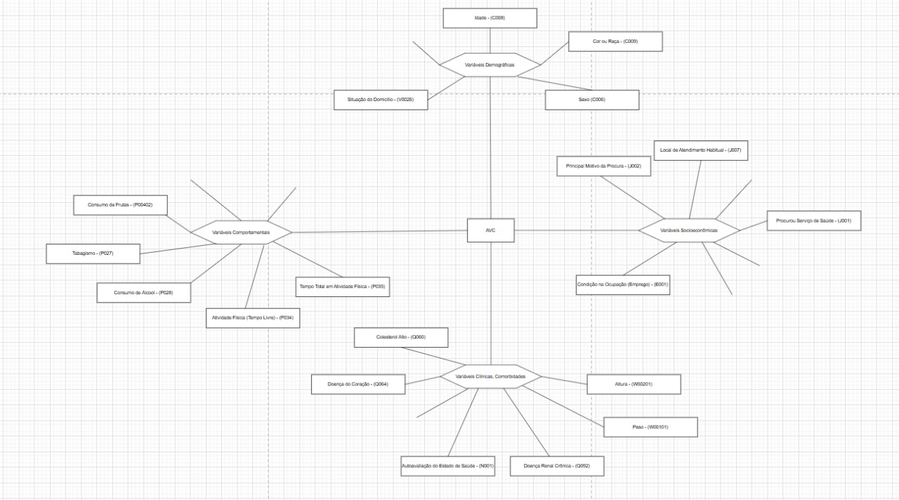
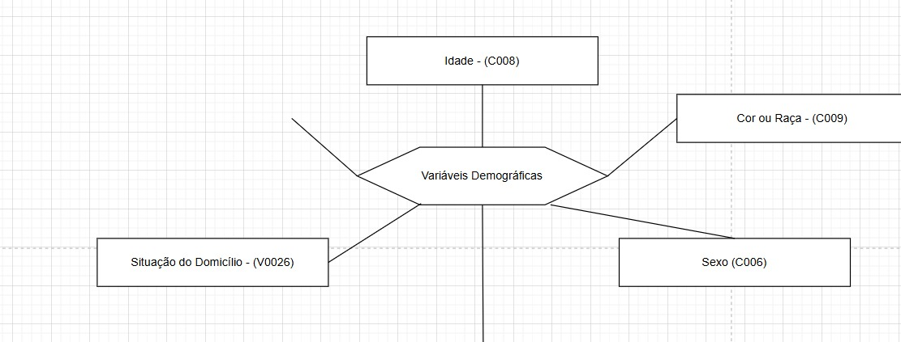
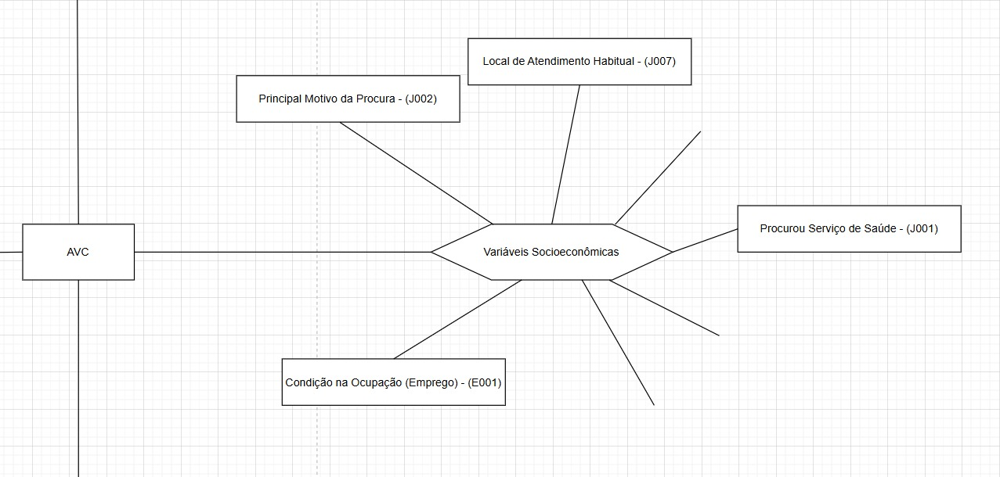
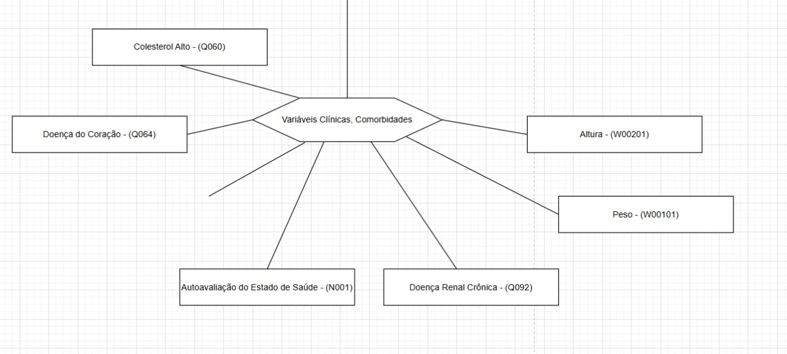
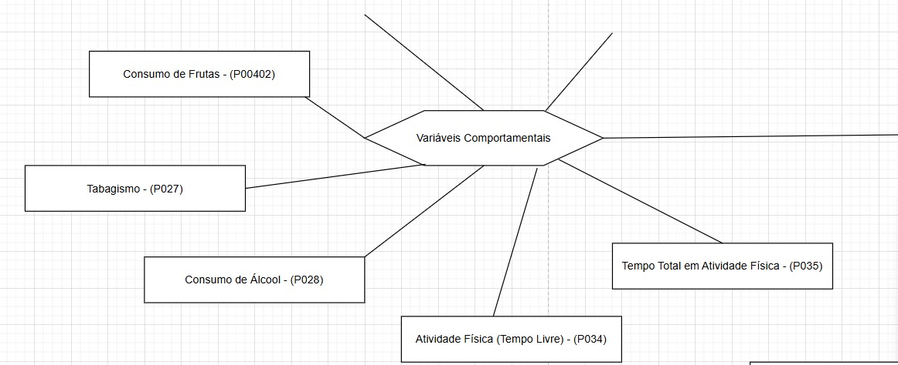

# Análise de fatores associados ao Acidente Vascular Cerebral (AVC)

**Iury Mota Santos, iury.santos@sga.pucminas.br**

**Thiago Andrade Monteiro, o.thiagoamonteiro@gmail.com**

**Iago Paiva Faria, iago.faria.1625316@sga.pucminas.br**

---

Professores:

**Gabriel Fonseca**

---

_Curso de Ciência de Dados, Unidade Praça da Liberdade_

_Instituto de Informática e Ciências Exatas – Pontifícia Universidade de Minas Gerais (PUC MINAS), Belo Horizonte – MG – Brasil_

---

_**Resumo**. O Acidente Vascular Cerebral (AVC), conhecido como derrame, é uma condição neurológica grave causada pela interrupção do fluxo sanguíneo no cérebro, seja por obstrução (isquêmico) ou rompimento de um vaso (hemorrágico). Essa interrupção gera falta de oxigênio e nutrientes, resultando em sequelas motoras, cognitivas ou até óbito. Globalmente, o AVC está entre as principais causas de morte e incapacidade. No Brasil, é uma das maiores causas de mortalidade, relacionado a fatores como hipertensão, diabetes, tabagismo, sedentarismo e envelhecimento. Além dos impactos individuais, gera elevados custos sociais e econômicos. A Pesquisa Nacional de Saúde (PNS 2019), realizada pelo IBGE e Ministério da Saúde, fornece dados representativos sobre condições de saúde e prevalência de doenças crônicas. Este projeto propõe analisar a PNS 2019 para identificar relações entre variáveis demográficas, clínicas e comportamentais associadas ao AVC. O objetivo é compreender padrões relevantes para a saúde pública e apoiar a conscientização social. Os dados e análises serão atualizados e disponibilizados no GitHub Classroom para organização e colaboração._

---

## Introdução

Este trabalho tem como foco a análise do Acidente Vascular Cerebral (AVC), uma das principais causas de morte e incapacidade no Brasil e no mundo. Utilizando os dados da Pesquisa Nacional de Saúde (PNS 2019), busca-se identificar fatores de risco e padrões associados à ocorrência da doença. A investigação considera variáveis demográficas, clínicas e comportamentais, contribuindo para a compreensão do impacto do AVC na população. Os resultados visam apoiar estratégias de prevenção e conscientização em saúde pública. 

###    Contextualização

O Acidente Vascular Cerebral (AVC) é um dos maiores desafios da saúde pública, figurando entre as principais causas de morte e incapacidade no mundo. Trata-se de uma condição neurológica grave, que pode ocorrer por obstrução de vasos sanguíneos (isquêmico) ou por seu rompimento (hemorrágico), resultando em sequelas motoras, cognitivas e elevado risco de óbito. No Brasil, estima-se que o AVC seja responsável por cerca de 100 mil mortes anuais, além de gerar custos sociais e econômicos significativos (Ministério da Saúde, 2021). Nesse contexto, a Pesquisa Nacional de Saúde (PNS 2019), realizada pelo IBGE, constitui uma base sólida para análises quantitativas sobre prevalência e fatores de risco da doença, permitindo identificar padrões relevantes. Assim, este trabalho insere-se na área da saúde pública e da epidemiologia, com o objetivo de compreender as características e determinantes do AVC na população brasileira.

###    Problema

O  AVC/Derrame apresenta elevada incidência no Brasil, sendo uma das principais causas de mortalidade e incapacidade funcional. Apesar de sua relevância, muitas vezes os fatores de risco associados à doença não são devidamente identificados ou monitorados pela população, o que dificulta ações preventivas eficazes. A ausência de análises integradas que relacionem características demográficas, clínicas e comportamentais ao AVC limita a compreensão dos determinantes dessa condição. Nesse contexto, surge a necessidade de utilizar bases de dados consolidadas, como a Pesquisa Nacional de Saúde (PNS 2019), para investigar padrões e fornecer insights e planejamentos direcionados a saúde pública.

###    Objetivo geral

Desenvolver uma análise baseada nos dados da Pesquisa Nacional de Saúde (PNS 2019) para investigar quais variáveis demográficas, clínicas e comportamentais estão associadas à ocorrência de Acidente Vascular Cerebral, possibilitando a identificação de padrões relevantes para a saúde pública.

- Pergunta Orientada a Dados: Quais fatores demográficos, clínicos e comportamentais estão mais associados à prevalência de Acidente Vascular Cerebral (AVC) na população brasileira, de acordo com os dados da Pesquisa Nacional de Saúde (PNS 2019)?

####    Objetivos específicos

- Analisar a relação entre variáveis demográficas e a ocorrência do AVC.

- Avaliar a influência de fatores de risco clínicos e comportamentais, como hipertensão, diabetes, tabagismo e sedentarismo.

- Construir gráficos e tabelas que permitam compreender os padrões identificados nos dados.

- Construir um modelo preditivo utilizando variáveis selecionadas, ajustando hiperparâmetros para otimizar seu desempenho.

- Avaliar métricas de validação do modelo, assegurando uma análise robusta e interpretável.

###    Justificativas

O desenvolvimento deste trabalho é motivado pela necessidade de compreender melhor os fatores associados à ocorrência do AVC na população brasileira. A escolha de analisar os dados da PNS 2019 permite explorar uma base confiável e representativa, possibilitando a identificação de padrões demográficos, clínicos e comportamentais relacionados à doença.

##    Público alvo

O público-alvo deste projeto é composto por:

- Pacientes diagnosticados com AVC.

- Indivíduos pertencentes a grupos de risco, como idosos, hipertensos, diabéticos, pessoas com histórico familiar de AVC, sedentários e fumantes.

- Profissionais da saúde envolvidos no acompanhamento, diagnóstico e reabilitação de pacientes com AVC.

- Gestores e formuladores de políticas públicas em saúde.

## Atividades e Responsabilidades Sprint (2)

- Seleção de variáveis -> Definição das variáveis principais para análise e das variáveis complementares que possam influenciar o modelo.
Responsável: Iury Mota

- Construção do modelo conceitual via Draw.io –> Elaboração de diagrama conceitual para melhor compreensão das variáveis selecionadas e do problema, facilitando a abstração e o planejamento da modelagem.
Responsável: Iury Mota

- Análise exploratória das variáveis –> Investigação inicial e básica dos dados, considerando distribuição, valores ausentes e possíveis outliers, facilitando a compreensão dos dados.
Responsável: Thiago Andrade

- Validação e cruzamento das variáveis –> Identificação de correlações relevantes entre variáveis demográficas, clínicas e comportamentais.
Responsável: Iago Paiva

## Análise exploratória dos dados

## Análise dos Fatores de Risco para o AVC
O diagrama organiza as variáveis demográficas, comportamentais, clínicas e socioeconômicas relacionadas ao AVC.

A partir dele, faremos agora uma análise de correlação para medir a força da associação entre cada um desses fatores e a ocorrência de um AVC, identificando as variáveis de maior impacto.

Após a exploração inicial dos dados, foi identificado que algumas das variáveis previamente selecionadas em nosso diagrama conceitual não estavam presentes no conjunto de dados final. Em função dessa indisponibilidade, foi necessário realizar um ajuste no escopo do projeto. As variáveis não encontradas foram, portanto, removidas da análise, que agora prosseguirá focada nos dados efetivamente validados.

## Cortes do Diagrama
## Variáveis Demográficas

## Variáveis Socioeconômicas

## Variáveis Clínicas

## Variáveis Comportamentais
]

## Variáveis Definidas

| Descrição                                           | Código da Variável | Status                    |
|---------------------------------------------------|------------------|---------------------------|
| Diagnóstico de AVC (Derrame)                     | q068             | Permaneceu na Análise   |
| Sexo                                              | c006             | Permaneceu na Análise   |
| Idade                                             | c008             | Permaneceu na Análise   |
| Cor ou Raça                                      | c009             | Permaneceu na Análise   |
| Situação do Domicílio (Urbano/Rural)            | v0026            | Permaneceu na Análise   |
| Diagnóstico de Colesterol Alto                   | q060             | Permaneceu na Análise   |
| Diagnóstico de Doença do Coração                 | q064             | Permaneceu na Análise   |
| Autoavaliação do Estado de Saúde                 | n001             | Permaneceu na Análise   |
| Diagnóstico de Doença Renal Crônica              | q092             | Permaneceu na Análise   |
| Peso (para o IMC)                                | w00101           | Permaneceu na Análise   |
| Altura (para o IMC)                              | w00201           | Permaneceu na Análise   |
| Tabagismo                                        | p027             | Permaneceu na Análise   |
| Prática de Atividade Física no tempo livre      | p034             | Permaneceu na Análise   |
| Tempo Total em Atividade Física                 | p035             | Permaneceu na Análise   |
| Consumo de Frutas (dias/semana)                 | p00402           | Permaneceu na Análise   |
| Condição na Ocupação (Emprego)                  | e001             | Permaneceu na Análise   |
| Se procurou serviço de saúde                     | j001             | Permaneceu na Análise   |
| Principal motivo da procura por saúde            | j002             | Permaneceu na Análise   |
| Local de atendimento habitual                    | j007             | Permaneceu na Análise   |
| Nível de Escolaridade                             | d009             | Foi Removida            |
| Diagnóstico de Hipertensão Arterial              | q002             | Foi Removida            |
| Diagnóstico de Diabetes                           | q030             | Foi Removida        |
| Consumo de Verduras e Legumes (dias/semana)      | p00802           | Foi Removida            |
| Consumo de Refrigerante ou Suco Artificial       | p025             | Foi Removida            |
| Autoavaliação do Consumo de Sal                  | p020             | Foi Removida          |
| Posse de Plano de Saúde                           | i001             | Foi Removida           |
| Rendimento Domiciliar Per Capita                 | f00101           | Foi Removida            |

###    Dicionário de dados

Apresente uma descrição das bases de dados a serem utilizadas. 
Dicionários de dados devem conter as bases de dados, os nomes dos atributos 
com seu significado, seu tipo (inteiro, real, textual, categórico, etc).

Este projeto deve utilizar pelo menos duas fontes de dados. Uma fonte principal e 
uma fonte para enriquecimentos dos dados principais.

###    Descrição de dados

Utilize a análise descritiva baseada em estatística de primeira ordem para descrever os dados.
Como descrever dados numéricos: média, desvio padrão, mínimo, máximo, quartis, histograma, etc.
Como descrever dados qualitativos (categóricos): moda (valor mais frequente), quantidade de valores distintos (categorias), distribuição das categorias (histograma), etc.

## Preparação dos dados

A preparação dos dados consiste dos seguintes passos:

> - Seleção dos atributos
> - Tratamentos dos valores faltantes ou omissos: remoção, substituição, indução, etc.
> - Tratamento dos valores inconsistentes: conversão, remoção de dados duplicados, remoção ou tratamento de ouliers.
> - Conversão de dados: p. ex. numérico para categórico, categórico para binário, etc.

## Indução de modelos

### Modelo 1: Algoritmo

Substitua o título pelo nome do algoritmo que será utilizado. P. ex. árvore de decisão, rede neural, SVM, etc.
Justifique a escolha do modelo.
Apresente o processo utilizado para amostragem de dados (particionamento, cross-validation).
Descreva os parâmetros utilizados. 
Apresente trechos do código utilizado comentados. Se utilizou alguma ferramenta gráfica, apresente imagens
com o fluxo de processamento.

### Modelo 2: Algoritmo

Repita os passos anteriores para o segundo modelo.

## Resultados

### Resultados obtidos com o modelo 1.

Apresente aqui os resultados obtidos com a indução do modelo 1. 
Apresente uma matriz de confusão quando pertinente. Apresente as medidas de performance
apropriadas para o seu problema. 
Por exemplo, no caso de classificação: precisão, revocação, F-measure, acurácia.

### Interpretação do modelo 1

Apresente os parâmetros do modelo obtido. Tentre mostrar as regras que são utilizadas no
processo de 'raciocínio' (*reasoning*) do sistema inteligente. Utilize medidas como 
o *feature importances* para tentar entender quais atributos o modelo se baseia no
processo de tomada de decisão.

### Resultados obtidos com o modelo 2.

Repita o passo anterior com os resultados do modelo 2.

### Interpretação do modelo 2

Repita o passo anterior com os parâmetros do modelo 2.

## Análise comparativa dos modelos

Discuta sobre as forças e fragilidades de cada modelo. Exemplifique casos em que um
modelo se sairia melhor que o outro. Nesta seção é possível utilizar a sua imaginação
e extrapolar um pouco o que os dados sugerem.

### Distribuição do modelo (opcional)

Tende criar um pacote de distribuição para o modelo construído, para ser aplicado 
em um sistema inteligente.

## 8. Conclusão

Apresente aqui a conclusão do seu trabalho. Discussão dos resultados obtidos no trabalho, 
onde se verifica as observações pessoais de cada aluno.

Uma conclusão deve ter 3 partes:

   * Breve resumo do que foi desenvolvido
	 * Apresenação geral dos resultados obtidos com discussão das vantagens e desvantagens do sistema inteligente
	 * Limitações e possibilidades de melhoria

# REFERÊNCIAS

Como um projeto de sistema inteligente não requer revisão bibliográfica, 
a inclusão das referências não é obrigatória. No entanto, caso você 
tenha utilizado referências na introdução ou deseje 
incluir referências relacionadas às tecnologias, padrões, ou metodologias 
que serão usadas no seu trabalho, relacione-as de acordo com a ABNT.

Verifique no link abaixo como devem ser as referências no padrão ABNT:

http://www.pucminas.br/imagedb/documento/DOC\_DSC\_NOME\_ARQUI20160217102425.pdf

Por exemplo:

**[1]** - _ELMASRI, Ramez; NAVATHE, Sham. **Sistemas de banco de dados**. 7. ed. São Paulo: Pearson, c2019. E-book. ISBN 9788543025001._

**[2]** - _COPPIN, Ben. **Inteligência artificial**. Rio de Janeiro, RJ: LTC, c2010. E-book. ISBN 978-85-216-2936-8._

**[3]** - _CORMEN, Thomas H. et al. **Algoritmos: teoria e prática**. Rio de Janeiro, RJ: Elsevier, Campus, c2012. xvi, 926 p. ISBN 9788535236996._

**[4]** - _SUTHERLAND, Jeffrey Victor. **Scrum: a arte de fazer o dobro do trabalho na metade do tempo**. 2. ed. rev. São Paulo, SP: Leya, 2016. 236, [4] p. ISBN 9788544104514._

**[5]** - _RUSSELL, Stuart J.; NORVIG, Peter. **Inteligência artificial**. Rio de Janeiro: Elsevier, c2013. xxi, 988 p. ISBN 9788535237016._

# APÊNDICES

**Colocar link:**

Do código (armazenado no repositório);

Dos artefatos (armazenado do repositório);

Da apresentação final (armazenado no repositório);

Do vídeo de apresentação (armazenado no repositório).

