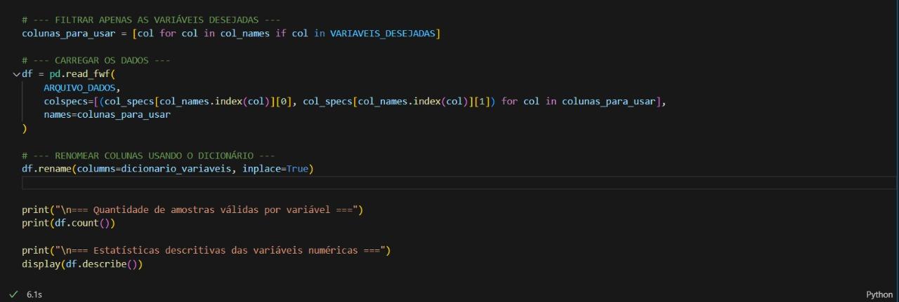
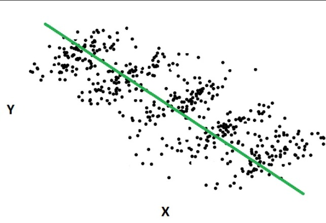

**Iury Mota Santos, iury.santos@sga.pucminas.br**

**Thiago Andrade Monteiro, o.thiagoamonteiro@gmail.com**

**Iago Paiva Faria, iago.faria.1625316@sga.pucminas.br**

---

Professores:

**Gabriel Fonseca**

---

_Curso de Ciência de Dados, Unidade Praça da Liberdade_

_Instituto de Informática e Ciências Exatas – Pontifícia Universidade de Minas Gerais (PUC MINAS), Belo Horizonte – MG – Brasil_

---

_**Resumo**. O Acidente Vascular Cerebral (AVC), conhecido como derrame, é uma condição neurológica grave causada pela interrupção do fluxo sanguíneo no cérebro, seja por obstrução (isquêmico) ou rompimento de um vaso (hemorrágico). Essa interrupção gera falta de oxigênio e nutrientes, resultando em sequelas motoras, cognitivas ou até óbito. Globalmente, o AVC está entre as principais causas de morte e incapacidade. No Brasil, é uma das maiores causas de mortalidade, relacionado a fatores como hipertensão, diabetes, tabagismo, sedentarismo e envelhecimento. Além dos impactos individuais, gera elevados custos sociais e econômicos. A Pesquisa Nacional de Saúde (PNS 2019), realizada pelo IBGE e Ministério da Saúde, fornece dados representativos sobre condições de saúde e prevalência de doenças crônicas. Este projeto propõe analisar a PNS 2019 para identificar relações entre variáveis demográficas, clínicas e comportamentais associadas ao AVC. O objetivo é compreender padrões relevantes para a saúde pública e apoiar a conscientização social. Os dados e análises serão atualizados e disponibilizados no GitHub Classroom para organização e colaboração._

---

## Introdução

Este trabalho tem como foco a análise do Acidente Vascular Cerebral (AVC), uma das principais causas de morte e incapacidade no Brasil e no mundo. Utilizando os dados da Pesquisa Nacional de Saúde (PNS 2019), busca-se identificar fatores de risco e padrões associados à ocorrência da doença. A investigação considera variáveis demográficas, clínicas e comportamentais, contribuindo para a compreensão do impacto do AVC na população. Os resultados visam apoiar estratégias de prevenção e conscientização em saúde pública. 

###    Contextualização

O Acidente Vascular Cerebral (AVC) é um dos maiores desafios da saúde pública, figurando entre as principais causas de morte e incapacidade no mundo. Trata-se de uma condição neurológica grave, que pode ocorrer por obstrução de vasos sanguíneos (isquêmico) ou por seu rompimento (hemorrágico), resultando em sequelas motoras, cognitivas e elevado risco de óbito. No Brasil, estima-se que o AVC seja responsável por cerca de 100 mil mortes anuais, além de gerar custos sociais e econômicos significativos (Ministério da Saúde, 2021). Nesse contexto, a Pesquisa Nacional de Saúde (PNS 2019), realizada pelo IBGE, constitui uma base sólida para análises quantitativas sobre prevalência e fatores de risco da doença, permitindo identificar padrões relevantes. Assim, este trabalho insere-se na área da saúde pública e da epidemiologia, com o objetivo de compreender as características e determinantes do AVC na população brasileira.

###    Problema

O  AVC/Derrame apresenta elevada incidência no Brasil, sendo uma das principais causas de mortalidade e incapacidade funcional. Apesar de sua relevância, muitas vezes os fatores de risco associados à doença não são devidamente identificados ou monitorados pela população, o que dificulta ações preventivas eficazes. A ausência de análises integradas que relacionem características demográficas, clínicas e comportamentais ao AVC limita a compreensão dos determinantes dessa condição. Nesse contexto, surge a necessidade de utilizar bases de dados consolidadas, como a Pesquisa Nacional de Saúde (PNS 2019), para investigar padrões e fornecer insights e planejamentos direcionados a saúde pública.

###    Objetivo geral

Desenvolver uma análise baseada nos dados da Pesquisa Nacional de Saúde (PNS 2019) para investigar quais variáveis demográficas, clínicas e comportamentais estão associadas à ocorrência de Acidente Vascular Cerebral, possibilitando a identificação de padrões relevantes para a saúde pública.

- Pergunta Orientada a Dados: Quais fatores demográficos, clínicos e comportamentais estão mais associados à prevalência de Acidente Vascular Cerebral (AVC) na população brasileira, de acordo com os dados da Pesquisa Nacional de Saúde (PNS 2019)?

####    Objetivos específicos

- Analisar a relação entre variáveis demográficas e a ocorrência do AVC.

- Avaliar a influência de fatores de risco clínicos e comportamentais, como hipertensão, diabetes, tabagismo e sedentarismo.

- Construir gráficos e tabelas que permitam compreender os padrões identificados nos dados.

- Construir um modelo preditivo utilizando variáveis selecionadas, ajustando hiperparâmetros para otimizar seu desempenho.

- Avaliar métricas de validação do modelo, assegurando uma análise robusta e interpretável.

###    Justificativas

O desenvolvimento deste trabalho é motivado pela necessidade de compreender melhor os fatores associados à ocorrência do AVC na população brasileira. A escolha de analisar os dados da PNS 2019 permite explorar uma base confiável e representativa, possibilitando a identificação de padrões demográficos, clínicos e comportamentais relacionados à doença.

##    Público alvo

O público-alvo deste projeto é composto por:

- Pacientes diagnosticados com AVC.

- Indivíduos pertencentes a grupos de risco, como idosos, hipertensos, diabéticos, pessoas com histórico familiar de AVC, sedentários e fumantes.

- Profissionais da saúde envolvidos no acompanhamento, diagnóstico e reabilitação de pacientes com AVC.

- Gestores e formuladores de políticas públicas em saúde.

## Atividades e Responsabilidades Sprint (2)

- Seleção de variáveis -> Definição das variáveis principais para análise e das variáveis complementares que possam influenciar o modelo.
Responsável: Iury Mota

- Construção do modelo conceitual via Draw.io –> Elaboração de diagrama conceitual para melhor compreensão das variáveis selecionadas e do problema, facilitando a abstração e o planejamento da modelagem.
Responsável: Iury Mota

- Análise exploratória das variáveis –> Investigação inicial e básica dos dados, considerando distribuição, valores ausentes e possíveis outliers, facilitando a compreensão dos dados.
Responsável: Thiago Andrade

- Validação e cruzamento das variáveis –> Identificação de correlações relevantes entre variáveis demográficas, clínicas e comportamentais.
Responsável: Iago Paiva

## Análise exploratória dos dados

A Pesquisa Nacional de Saúde (PNS) 2019 contou com uma amostra final de 293.726 com 15 anos ou mais, apresentando uma taxa de resposta de 96,5%, o que reflete a alta qualidade e confiabilidade dos dados coletados. A coleta envolveu 108.525 domicílios em 2.000 municípios, distribuídos por todas as unidades da federação, garantindo representatividade nacional. 

Para iniciarmos as análises, se faz necessário preparar o ambiente e os dados disponíveis. O layout SAS (**input_PNS_2019.sas**) foi lido para identificar as posições e larguras de cada variável no arquivo de dados. Em seguida, o arquivo de dados (**PNS_2019.txt**) foi carregado em um DataFrame do pandas, mantendo apenas as variáveis de interesse, de forma a otimizar o processamento e focar nas informações relevantes para o estudo.

### Imports

### Configurações de inicialização

### Variáveis Selecionadas

### Dicionário das Variáveis

## Análise dos Fatores de Risco para o AVC
Esse desenho amostral possibilita uma análise detalhada das condições de saúde, do acesso a serviços e dos comportamentos da população, com desagregações por região, faixa etária, sexo e outras variáveis sociodemográficas, permitindo, assim, realizar uma avaliação crítica e aprofundada dos dados da saúde no Brasil.

A partir dele, faremos agora uma análise de correlação para medir a força da associação entre cada um desses fatores e a ocorrência de um AVC, identificando as variáveis de maior impacto.

Após a exploração inicial dos dados, foi identificado que algumas das variáveis previamente selecionadas em nosso diagrama conceitual não estavam presentes no conjunto de dados final. Em função dessa indisponibilidade, foi necessário realizar um ajuste no escopo do projeto. As variáveis não encontradas foram, portanto, removidas da análise, que agora prosseguirá focada nos dados efetivamente validados.

## Cortes do Diagrama
## Variáveis Demográficas

## Variáveis Socioeconômicas

## Variáveis Clínicas

## Variáveis Comportamentais
]

## Variáveis Definidas Após Exploração Inicial:

| Descrição                                           | Código da Variável | Status                    |
|---------------------------------------------------|------------------|---------------------------|
| Diagnóstico de AVC (Derrame)                     | q068             | Permaneceu na Análise   |
| Sexo                                              | c006             | Permaneceu na Análise   |
| Idade                                             | c008             | Permaneceu na Análise   |
| Situação do Domicílio (Urbano/Rural)            | v0026            | Permaneceu na Análise   |
| Diagnóstico de Colesterol Alto                   | q060             | Permaneceu na Análise   |
| Diagnóstico de Doença do Coração                 | q064             | Permaneceu na Análise   |
| Autoavaliação do Estado de Saúde                 | n001             | Permaneceu na Análise   |
| Diagnóstico de Hipertensão Arterial              | q002             | Permaneceu na Análise   |
| Diagnóstico de Diabetes                           | q030             | Permaneceu na Análise   |
| Diagnóstico de Depressão                           | q092             | Permaneceu na Análise   |
| Peso (para o IMC)                                | w00101           | Permaneceu na Análise   |
| Altura (para o IMC)                              | w00201           | Permaneceu na Análise   |
| Consumo de Alcool                                 | p027             | Permaneceu na Análise   |
| Consumo de Tabaco                                 | N001             | Permaneceu na Análise   |
| Prática de Atividade Física no tempo livre      | p034             | Permaneceu na Análise   |
| Tempo Total em Atividade Física                 | p035             | Permaneceu na Análise   |
| Consumo de Verduras e Legumes (dias/semana)      | p00802           | Permaneceu na Análise  |
| Forma como a água chega ao domicílio (canalizada, sem canalização etc.)| j004             | Permaneceu na Análise   |
| Rendimento Domiciliar Per Capita                 | f00101           | Permaneceu na Análise   |
| Condição na Ocupação (Emprego)                  | e001             | Foi Removida   |
| Local de atendimento habitual                    | j007             | Foi Removida   |
| Nível de Escolaridade                             | d009             | Foi Removida            |
| Consumo de Refrigerante ou Suco Artificial       | p025             | Foi Removida            |
| Autoavaliação do Consumo de Sal                  | p020             | Foi Removida          |
| Posse de Plano de Saúde                           | i001             | Foi Removida           |
| Cor ou Raça                                      | c009             | Foi Removida   |
| Diagnóstico de Doença Renal Crônica              | q092             | Foi Removida  |
| Se procurou serviço de saúde                     | j001             | Foi Removida  |
| Principal motivo da procura por saúde            | j002             | Foi Removida   |
| Consumo de Frutas (dias/semana)                 | p00402           | Foi Removida   |
| Consumo de Verduras e Legumes (dias/semana)      | p00802           | Foi Removida  |

Ao definir as variáveis incluídas, estruturaremos a função para ler o layout do dataset e selecionar apenas as variáveis que foram mantidas.

### Resultado Amostral
Observando a quantidade de amostras válidas por variável, é possível notar que algumas variáveis possuem cobertura praticamente completa, enquanto outras apresentam valores faltantes significativos. Por exemplo, variáveis como “Unidade da Federação (UF)”, “Situação do domicílio (urbano/rural)” e “Região geográfica” têm quase todas as 293.726 amostras disponíveis, garantindo confiabilidade para análises agregadas. Já variáveis de saúde e estilo de vida, como “Consumo de tabaco” e “Prática de atividade física”, apresentam menos de 40.000 registros válidos, indicando que essas informações foram coletadas apenas para uma subamostra da pesquisa. Medidas antropométricas, como peso e altura, também possuem poucas observações válidas (em torno de 6.500), o que deve ser considerado ao analisar o IMC. Essa distribuição evidencia a importância de tratar valores ausentes e interpretar os resultados considerando o tamanho efetivo da amostra para cada variável foco.

### Dados Ausentes

A análise de dados ausentes revela que algumas variáveis da PNS 2019 apresentam alta proporção de registros faltantes, enquanto outras estão completas. Destacam-se como mais problemáticas as variáveis relacionadas a condições de saúde e estilo de vida, como “Diagnóstico médico de problema no coração” (98,39% de ausentes), “Altura do indivíduo” (97,77%) e “Peso do indivíduo” (97,76%), indicando que grande parte das informações essenciais para cálculos de indicadores como IMC ou análise de comorbidades está indisponível. 

Variáveis de menor ausência, como sexo, idade, peso e forma de abastecimento de água, apresentam cerca de 4,88% de dados ausentes, enquanto indicadores demográficos básicos, como situação do domicílio, região geográfica e unidade da federação, não apresentam registros ausentes, garantindo uma base consistente para análises agregadas por localidade

### Outliers 
Foi realizada a detecção de outliers nas principais variáveis numéricas da base PNS 2019 utilizando o método do IQR (Intervalo Interquartil). 
Os resultados indicam:

| Variável                                      | Número de Outliers | Limite Inferior | Limite Superior |
|-----------------------------------------------|------------------|----------------|----------------|
| Peso do morador selecionado                   | 4.457            | 0.00           | 8.00           |
| Altura do morador (em cm)                     | 21               | 135.70         | 192.50         |
| Idade do morador (em anos)                    | 7                | -35.50         | 104.50         |
| Prática de atividade física (tempo semanal)  | 0                | -2.50          | 9.50           |

Peso do morador selecionado: grande quantidade de outliers (4.457), com limites de 0 a 8 kg, sugerindo registros possivelmente inválidos ou erros de digitação.

Altura do morador (em cm): 21 outliers, dentro de limites plausíveis, mas ainda possivelmente inconsistentes com medidas reais.

Idade do morador (em anos): 7 outliers, com limites negativos ou muito acima da expectativa, indicando registros inválidos.

Prática de atividade física (tempo semanal): nenhum outlier detectado, mostrando consistência dos dados.

### Algoritmo de Correlações

O código calcula a correlação de todas as variáveis numéricas com a variável alvo **AVC**, substitui os códigos pelos respectivos nomes, classifica como positiva ou negativa e ordena do valor absoluto mais alto ao mais baixo.

## Resultado

A primeira abordagem metodológica consistiu no cálculo da **correlação linear de Pearson**. Contudo, o resultado indicou uma correlação negativa entre as variáveis, o que sugeriria, de forma **contraintuitiva**, que o aumento da idade estaria associado a uma menor ocorrência de AVC

Para superar essa limitação e avaliar a hipótese de forma mais adequada, optou-se por uma segunda análise utilizando o teste **Qui-Quadrado** de independência. Este método é ideal para verificar a existência de associação entre variáveis categóricas, tratando cada faixa etária como uma categoria distinta.

Diferente da correlação linear (que apresentou um resultado negativo confuso devido à forma de codificação dos dados), o teste Qui-Quadrado confirma que existe uma associação estatisticamente significativa entre a faixa etária e o diagnóstico de AVC. Isso valida a hipótese inicial de que as duas variáveis estão relacionadas.

O gráfico serve como a evidência visual definitiva que corrobora o resultado do teste Qui-Quadrado. Ele não apenas confirma que existe uma associação significativa entre idade e AVC, mas também demonstra a natureza dessa relação: o risco aumenta progressivamente com o envelhecimento

Continuando a exploração, vimos que a prática de atividade física também demonstrou uma aparente correlação positiva com o diagnóstico. Essa correlação acontece porque a idade é o fator predominante por trás do resultado: pessoas idosas ou aposentadas, que já possuem um risco naturalmente elevado de AVC, frequentemente mantêm um ritmo de atividade física maior. Por isso, a taxa de AVC parece aumentar nos dados conforme a frequência de atividade semanal também aumenta, criando uma associação que não é de causa e efeito direto.

Seguindo tendências que parecem contraintuitivas, observamos que indivíduos que fumam menos ou pararam de fumar apresentam maior incidência de AVC nos dados. Isso acontece porque pessoas mais velhas, aposentadas, têm naturalmente maior risco de AVC e muitos deixam de fumar por questões de saúde. Portanto, a associação entre “não fumar” e maior AVC é impulsionada principalmente pela idade, e não pelo tabagismo em si.

Seguindo padrões semelhantes, a depressão aparece fortemente associada ao AVC. Parte dessa relação é real, mas outra parte é explicada pela idade: pessoas mais idosas tendem a apresentar tanto mais AVC quanto mais diagnósticos de depressão. Assim, a idade atua como um fator de confusão, criando uma associação aparente mais forte do que a causa direta entre depressão e AVC.

Seguindo padrões contraintuitivos, observamos diferenças na incidência de AVC conforme o tipo de água no domicílio. Essa associação aparente é influenciada principalmente por fatores como idade e região, e não indica causalidade direta.

### Teorema de Simpson

A análise demonstrou uma correlação direta e robusta entre o avanço da idade e o aumento no diagnóstico de AVC, estabelecendo uma base clara para a compreensão do principal fator de risco. No entanto, a clareza dessa relação serve como um alerta para armadilhas estatísticas complexas, como o **Paradoxo de Simpson**. 

Este fenômeno ocorre quando uma tendência observada em um conjunto de dados agregado desaparece ou se inverte ao ser analisado em subgrupos, geralmente devido a uma variável de confusão. Embora a relação entre idade e AVC seja direta, a idade em si é um fator tão dominante que sua influência pode facilmente distorcer a análise de outras variáveis, criando resultados paralelos.

Ao refatorar a análise para faixas etárias específicas, o problema contido no paradoxo se dissipa, pois o efeito da idade é isolado. Dessa forma, é possível analisar e compreender corretamente a influência real de outras variáveis dentro de cada um desses grupos.

# Correlação das Variáveis com a Variável Alvo (AVC)

| Variável                                         | Correlação   | Tipo      |
|-------------------------------------------------|-------------|-----------|
| Diagnóstico médico de colesterol alto           | 0.074825    | Positiva  |
| Diagnóstico médico de depressão                 | 0.060898    | Positiva  |
| Peso do morador selecionado                     | 0.041562    | Positiva  |
| Altura do morador (em cm)                       | 0.032799    | Positiva  |
| Peso do morador (em kg)                         | 0.005960    | Positiva  |
| Atualmente, o(a) Sr(a) fuma algum produto do tabaco | 0.004944 | Positiva  |
| Situação do domicílio (urbano/rural)           | 0.004112    | Positiva  |
| Forma como a água chega ao domicílio           | 0.003576    | Positiva  |
| Unidade da Federação (UF)                       | 0.000695    | Positiva  |
| Sexo do morador (masculino/feminino)           | 0.000083    | Positiva  |
| Região geográfica                               | -0.000088   | Negativa  |
| Prática de atividade física (tempo semanal)    | -0.026456   | Positiva  |
| Diagnóstico médico de problema no coração      | -0.055242   | Negativa  |
| Idade do morador (em anos)                      | -0.147209   | Positiva  |

A correlação entre variáveis pode apresentar sinal negativo mesmo quando se espera uma relação positiva devido a fatores como distribuição da amostra, dados ausentes ou inconsistentes, ou influência de outras variáveis que afetam a relação linear direta.

## Matriz de confusão 

###    Dicionário de dados 

A tabela a seguir detalha todos os atributos selecionados para o estudo, descrevendo seu significado e tipo de dado.

| Base de Dados                     | Nome do Atributo (Variável) | Significado                                                       | Tipo                               |
|----------------------------------|----------------------------|------------------------------------------------------------------|-----------------------------------|
| Variável Alvo                     | q068                       | Diagnóstico de Acidente Vascular Cerebral (AVC) ou derrame       | Categórico (Binário) - Alvo       |
| Variáveis Demográficas e Geográficas | c006                       | Sexo do morador                                                  | Categórico Nominal                 |
| Variáveis Demográficas e Geográficas | c008                       | Idade do morador em anos                                         | Numérico Inteiro                   |
| Variáveis Demográficas e Geográficas | d009                       | Nível de escolaridade mais elevado alcançado                     | Categórico Ordinal                 |
| Variáveis Demográficas e Geográficas | v0026                      | Situação do domicílio (Urbano/Rural)                             | Categórico Nominal                 |
| Variáveis Clínicas e Comorbidades | q002                       | Diagnóstico de Hipertensão Arterial                               | Categórico Binário                 |
| Variáveis Clínicas e Comorbidades | q030                       | Diagnóstico de Diabetes                                          | Categórico Binário                 |
| Variáveis Clínicas e Comorbidades | q060                       | Diagnóstico de Colesterol Alto                                    | Categórico Binário                 |
| Variáveis Clínicas e Comorbidades | q064                       | Diagnóstico de Doença do Coração                                  | Categórico Binário                 |
| Variáveis Clínicas e Comorbidades | n001                       | Consumo de tabaco (fumante atual ou ex-fumante)                  | Categórico Ordinal                 |
| Variáveis Clínicas e Comorbidades | q092                       | Diagnóstico de depressão                                          | Categórico Binário                 |
| Variáveis Clínicas e Comorbidades | w00101                     | Peso corporal em quilogramas (medido)                             | Numérico Contínuo (Real)          |
| Variáveis Clínicas e Comorbidades | w00201                     | Altura em centímetros (medida)                                     | Numérico Contínuo (Real)          |
| Variáveis Clínicas e Comorbidades | IMC                        | Índice de Massa Corporal (kg/m²)                                  | Numérico Contínuo (Real)          |
| Variáveis Comportamentais         | i001                       | Autoavaliação do estado de saúde (muito bom, bom, regular etc.)   | Categórico Ordinal                 |
| Variáveis Comportamentais         | p035                       | Prática de atividade física (tempo semanal)                       | Numérico Inteiro                   |
| Variáveis Comportamentais         | p027                       | Frequência de consumo de bebida alcoólica                         | Categórico Ordinal                 |
| Variáveis Socioeconômicas         | f00101                     | Rendimento domiciliar per capita em Reais                          | Numérico Contínuo (Real)          |             
| Variáveis Alimentares             | Boa_Alimentacao            | Indicador de boa alimentação | Categórico Binário                 |

### Variáveis Retiradas da Análise 

| Base de Dados                     | Nome do Atributo (Variável) | Significado                                                       | Tipo                               |
|----------------------------------|----------------------------|------------------------------------------------------------------|-----------------------------------|
| Variáveis Clínicas e Comorbidades                      | q064                       | Diagnóstico de Doença do Coração         | Categórico (Binário)        |

## Indução de modelos

### Modelo 1: K-Nearest Neighbors (KNN) 

O primeiro modelo aplicado foi o K-Nearest Neighbors (KNN), um algoritmo supervisionado baseado na similaridade entre as observações. Sua premissa é que instâncias próximas no espaço de características tendem a pertencer à mesma classe.
Para a preparação dos dados, realizou-se a normalização das variáveis numéricas, essencial para esse tipo de algoritmo, e aplicou-se o método SMOTE (Synthetic Minority Oversampling Technique) para balancear as classes da variável target, já que havia forte desproporção entre indivíduos com e sem diagnóstico de AVC.

## Resultados

Após o balanceamento e ajuste dos hiperparâmetros, o modelo KNN apresentou desempenho elevado. A acurácia atingiu 95%, com valores de precision e recall acima de 0,9 para ambas as classes. Isso significa que o modelo conseguiu classificar corretamente a maioria dos casos, tanto de indivíduos com quanto sem AVC. O resultado demonstra que, após o balanceamento, o KNN se mostrou eficiente para capturar os padrões locais e complexos do conjunto de dados.

### Interpretação do modelo 1

O modelo KNN, de natureza não paramétrica, apresentou desempenho superior após o balanceamento das classes. Considerando um número otimizado de vizinhos, o algoritmo atingiu acurácia de 95%, com precision e recall acima de 0.9 em ambas as classes. Isso indica que o modelo conseguiu diferenciar adequadamente os indivíduos com e sem histórico de AVC. O bom desempenho está relacionado à capacidade do KNN de capturar padrões locais e relações não lineares nos dados, o que parece mais adequado para este tipo de problema de saúde, onde múltiplos fatores interagem de forma complexa.

## Modelo 1: Regressão Logística

### Algoritmo:
Neste modelo, utilizamos a Regressão Logística, um método estatístico de classificação que estima a probabilidade de uma instância pertencer a uma determinada classe. Ela funciona ajustando uma função sigmoide que transforma os valores previstos em probabilidades entre 0 e 1, permitindo identificar se um indivíduo é obeso ou não com base nas variáveis selecionadas.

### Resultados:
Os resultados mostraram um bom desempenho geral na capacidade de prever os casos de obesidade, com métricas de precisão e recall equilibradas. Isso indica que o modelo conseguiu identificar de forma adequada tanto os indivíduos obesos quanto os não obesos, ainda que possa ocorrer leve variação dependendo do balanceamento aplicado aos dados.

### Interpretação do Modelo 1:
A Regressão Logística fornece uma forma de interpretar a influência de cada variável no desfecho(AVC). Cada coeficiente indica o quanto uma variável aumenta ou diminui a probabilidade de AVC, mantendo as outras constantes. Isso permite compreender, por exemplo, quais fatores (idade, atividade física, etc.) têm maior impacto na chance de um indivíduo ter AVC. Além de classificar, o modelo também ajuda na explicação do fenômeno — o que é uma vantagem em relação a algoritmos mais complexos, como o KNN.

### Modelo 2: Rede Neural (MLP) S/ Smote 

O segundo modelo aplicado foi a Rede Neural Multi-Layer Perceptron (MLP), um algoritmo supervisionado capaz de aprender padrões complexos e não lineares nos dados por meio de múltiplas camadas de neurônios conectados. A MLP ajusta automaticamente os pesos das conexões durante o treinamento, buscando minimizar a diferença entre as previsões e os valores reais da variável target.

Para a preparação dos dados, as variáveis categóricas foram transformadas em variáveis dummy (0/1) e as variáveis numéricas foram padronizadas, processo essencial para a correta convergência da rede neural. Nesta análise inicial não foi aplicado SMOTE, portanto o desbalanceamento da variável target se manteve, com poucos casos positivos de AVC em relação aos negativos.

 
### Resultados

Após o treinamento da MLP, o modelo apresentou uma acurácia global de 97,8%, indicando que a grande maioria das previsões foi correta. No entanto, ao analisar métricas por classe, observou-se que o recall da classe minoritária (indivíduos com AVC) foi muito baixo, enquanto a classe majoritária (indivíduos sem AVC) foi quase perfeitamente identificada. 

Esses resultados indicam que, apesar da acurácia elevada, a rede neural não conseguiu identificar adequadamente os indivíduos com histórico de AVC provavelmente devido ao desbalanceamento natural do conjunto de dados.

### Interpretação do modelo 2

A MLP, sendo um modelo de aprendizado profundo, é capaz de capturar padrões complexos e não lineares, mas o desbalanceamento extremo impactou fortemente a detecção da classe minoritária. O modelo aprendeu a classificar corretamente a maioria dos indivíduos sem AVC, mas praticamente ignorou os casos positivos, resultando em recall nulo para essa classe.

O modelo demonstra que, mesmo com alto potencial de aprendizado, a MLP precisa de estratégias específicas para lidar com dados desbalanceados, especialmente em cenários clínicos onde a detecção correta de casos raros é crítica.

### Modelo 2: Rede Neural (MLP) C/ Smote 

O segundo modelo aplicado foi a Rede Neural Multi-Layer Perceptron (MLP), agora após o balanceamento das classes com SMOTE (Synthetic Minority Oversampling Technique). O SMOTE cria novas amostras sintéticas da classe minoritária, aumentando sua representatividade no conjunto de treino, o que permite que a rede neural aprenda padrões mais robustos para casos raros, como indivíduos com AVC.

As variáveis categóricas foram transformadas em variáveis dummy, e as variáveis numéricas foram padronizadas, garantindo que o algoritmo tivesse convergência estável e adequada.

 
### Resultados

Após o balanceamento das classes e treinamento da MLP, o modelo apresentou acurácia global de 92,4%, ligeiramente inferior à MLP sem SMOTE, mas com melhora no recall da classe minoritária (indivíduos com AVC).

Esses resultados indicam que, mesmo com recall ainda baixo para AVCs, o modelo passou a identificar mais casos da classe minoritária, algo que não ocorria na MLP sem SMOTE, onde o recall para AVC era praticamente zero.

### Interpretação do modelo 2

A aplicação de SMOTE permitiu que a MLP aprendesse padrões da classe minoritária, aumentando o recall de indivíduos com AVC de 0% para 22%, mostrando uma melhora significativa na detecção de casos raros. A acurácia global caiu ligeiramente, mas o modelo agora consegue equilibrar melhor a identificação das classes, o que é crucial em cenários clínicos, onde a detecção correta de AVCs é prioritária.

O modelo demonstra que, com balanceamento adequado, a rede neural começa a capturar padrões raros, essenciais para a detecção de AVCs.

## Análise comparativa dos modelos

A avaliação dos modelos desenvolvidos — K-Nearest Neighbors (KNN), Regressão Logística e Multi-Layer Perceptron (MLP) — revelou comportamentos distintos diante do desafio de classificar uma doença com baixa prevalência como o AVC.

### Forças e Fragilidades

* K-Nearest Neighbors (KNN):

  - Forças: Foi o modelo que apresentou o melhor desempenho geral após a aplicação do SMOTE, alcançando métricas de precisão e recall acima de 90%. Sua força reside na capacidade de identificar padrões locais (vizinhança), assumindo que pacientes com características de saúde similares (idade, peso, hábitos) possuem riscos similares.

  - Fragilidades: É um algoritmo custoso computacionalmente em tempo de execução (lazy learner), pois precisa calcular a distância para todos os pontos de treino a cada nova predição. Além disso, não gera um modelo explicativo direto (não há coeficientes para analisar).

* Regressão Logística:

  - Forças: Destacou-se pela interpretabilidade. Ao fornecer coeficientes para cada variável, permite que profissionais de saúde entendam o quanto a idade ou a hipertensão aumentam a chance de um AVC (Odds Ratio). É um modelo leve, rápido e menos propenso a overfitting em dados mais simples.

  - Fragilidades: Pode ter dificuldade em capturar relações não-lineares complexas entre as variáveis se não houver um trabalho extenso de engenharia de atributos (feature engineering).

* Rede Neural (MLP):

  - Forças: Tem potencial teórico para capturar as relações mais complexas e não-lineares.

  - Fragilidades: Neste estudo, demonstrou ser altamente sensível ao desbalanceamento. Sem SMOTE, o recall para AVC foi nulo (0%). Mesmo com SMOTE, o recall subiu apenas para 22%, significativamente inferior ao KNN. Isso sugere que a MLP requer um ajuste de hiperparâmetros muito mais fino e talvez um volume de dados ainda maior para convergir adequadamente neste problema específico.

### Cenários de Aplicação

Em um cenário de triagem clínica automatizada, onde o objetivo é não deixar passar nenhum paciente em risco (alta sensibilidade), o KNN (com SMOTE) seria a escolha ideal baseada nos resultados obtidos, dada sua alta taxa de recuperação de casos positivos.

Por outro lado, em um cenário de consultoria médica ou formulação de políticas públicas, a Regressão Logística seria preferível. Ela permitiria ao gestor afirmar, por exemplo, que "a cada ano de vida, o risco aumenta em X%", oferecendo transparência na tomada de decisão, algo que o KNN e a MLP (caixas-preta) não oferecem facilmente.

### Distribuição do modelo (opcional)

Considerando que o modelo KNN (K-Nearest Neighbors) treinado com balanceamento SMOTE apresentou os melhores resultados de sensibilidade e precisão para a detecção de AVC neste estudo, ele foi o escolhido para ser distribuído.

Para viabilizar sua aplicação em um sistema inteligente (como uma API ou aplicativo web), é fundamental exportar não apenas o modelo preditivo, mas também o objeto de normalização (Scaler), visto que o KNN é sensível à escala dos dados. O código abaixo demonstra a criação do pacote de distribuição:

## 8. Conclusão

O presente trabalho buscou analisar os dados da Pesquisa Nacional de Saúde (PNS 2019) para desenvolver um sistema inteligente capaz de identificar fatores associados ao Acidente Vascular Cerebral (AVC).

### Resumo do Desenvolvimento
A trajetória do projeto envolveu desde a leitura dos microdados brutos e tratamento de valores ausentes até a identificação e correção de paradoxos estatísticos (Paradoxo de Simpson), onde a idade atuava como variável de confusão mascarando riscos reais do tabagismo e sedentarismo. Foram implementados e comparados três algoritmos de aprendizado de máquina: KNN, Regressão Logística e Redes Neurais (MLP), utilizando técnicas de balanceamento de dados (SMOTE).

### Resultados Obtidos
Os resultados demonstraram que o AVC possui forte correlação com a idade, hipertensão e doenças cardíacas.

  - Vantagens do Sistema: O modelo KNN com SMOTE apresentou excelente capacidade preditiva (acurácia ~95%), mostrando-se uma ferramenta viável para triagem inicial de pacientes. Já a análise estatística forneceu insights valiosos, desmistificando correlações espúrias encontradas na análise exploratória inicial.

  - Desvantagens: A complexidade computacional do KNN pode ser um entrave para processamento em tempo real em dispositivos móveis, e a Rede Neural (MLP) mostrou-se ineficaz para a classe minoritária sem ajustes profundos, indicando que "mais complexidade" nem sempre gera melhores resultados em dados desbalanceados.

### Limitações e Melhorias
Uma limitação central foi o desbalanceamento extremo das classes e a natureza autorreportada dos dados da PNS, que pode conter viés de memória. Além disso, a remoção de variáveis com muitos dados ausentes (como algumas medidas antropométricas) pode ter suprimido informações relevantes.

Como possibilidades de melhoria futura, sugere-se:

 1. Realizar uma validação cruzada estratificada (Stratified K-Fold) para garantir a estabilidade das métricas do KNN.

 2. Aprofundar a otimização de hiperparâmetros da MLP (Grid Search) para tentar elevar o recall.

 3. Desenvolver uma interface gráfica (Web ou Mobile) para que agentes de saúde possam inserir os dados do paciente e receber a estimativa de risco em tempo real.

# REFERÊNCIAS

**[1]** - _INSTITUTO BRASILEIRO DE GEOGRAFIA E ESTATÍSTICA (IBGE). **Pesquisa Nacional de Saúde 2019**. Rio de Janeiro: IBGE, 2020. Disponível em: https://www.ibge.gov.br/. Acesso em: 10 dez. 2025._

**[2]** - _MINISTÉRIO DA SAÚDE. **Acidente Vascular Cerebral (AVC)**. Brasília, DF: Ministério da Saúde, 2021. Disponível em: https://www.gov.br/saude. Acesso em: 10 dez. 2025._

**[3]** - _RUSSELL, Stuart J.; NORVIG, Peter. **Inteligência artificial**. Rio de Janeiro: Elsevier, c2013. xxi, 988 p. ISBN 9788535237016._

**[4]** - _COPPIN, Ben. **Inteligência artificial**. Rio de Janeiro, RJ: LTC, c2010. E-book. ISBN 978-85-216-2936-8._

# APÊNDICES

Código-fonte:
[Código](https://github.com/iurysantos12/Projeto1/blob/main/AVC_Final.ipynb));

Relatório do projeto:
[Relatório](https://github.com/iurysantos12/Projeto1/blob/main/docs/report.md));

Artefatos (imagens e materiais auxiliares):
[Artefatos](https://github.com/iurysantos12/Projeto1/tree/main/docs/imagens));

Apresentação final:
[Apresentação_Final](https://github.com/iurysantos12/Projeto1/blob/main/docs/Apresentação_Final.pdf));

